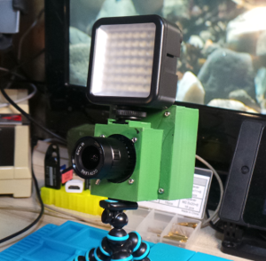

# Raspberry PI HQ Camera Case

This is a 3D Printed case for the Raspberry PI HQ Camera.

It comprises of 2 main components:
1. An enclosure for the camera module
1. An enclosure for a Raspberry PI 3A+ which attaches to the module.

## Camera enclosure

The camera enclosure contains the camera module with adequate protection from everyday use with a slot on the back to
allow the camera ribbon cable to exit.

There's to variant of this enclosure, with or without a camera shoe attachment which allows for lightweight items to be
attached to the camera like a microphone or a small light.

### Usage

For a plain enclosure use the following modules, one for each component:

    camera_mount(); 
    camera_backplate();

To include the shoe attachment:

    camera_mount(1); 
    camera_backplate(1);

## Raspberry PI 3A+ enclosure

The PI enclosure fits a Raspberry PI 3A+ and attaches to the camera enclosure sharing the same mounting holes on the
back making the entire setup look like a more traditional camera.

The initial version has no support for buttons, or a screen but the layout of the board is so that it can fit on a full
size camera tripod without any sockets being blocked by the tripod.

## Materials

For the print I used PLA for the prototypes & ABS for the final print but either can be used
(at the time I only had Black ABS on hand).

For assembly, you also require:
* 16 Male M2.5x5 screws
* 8 M2.5x11 spacers
* 4 M2.5x11+6 spacers
* 4 M2.5x20+6 spacers

## STL's

STL's are available on Thingiverse: https://www.thingiverse.com/thing:4384389

## Assembly instructions

I've made a video on how to assemble the enclosure: https://www.youtube.com/watch?v=vmBG335nT-8
